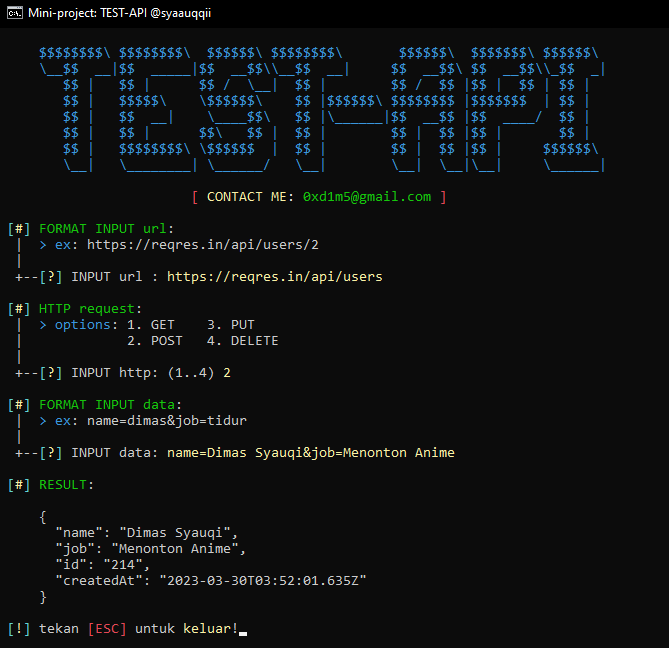

# TEST-API
Program berbasis CLI ini digunakan sebagai alternatif lain dari aplikasi POSTMAN, meskipun penggunaanya masih terbatas, tetapi ini alternatif yang bagus untuk melakukan manipulasi API.

TODO :
- [x] GET
- [x] POST
- [x] PUT
- [x] DELETE
- [x] Handle Error: Import Library
- [x] Handle Error: Input URL (Validasi URL)
- [x] Handle Error: Input http option (POST, PUT)
- [x] Handle Error: CTRL + C (stop program)
- [x] Handle Error: Input Data (POST)
- [x] Handle Error: Request HTTP cURL output
- [x] Handle Error: Path file / File tidak ditemukan
- [x] Menambahkan sedikit UI meskipun sederhana 😅

## Bahan (Windows)
1. Download [jQ](https://github.com/stedolan/jq/releases/download/jq-1.6/jq-win64.exe)
2. Download [cURL](https://curl.se/windows/)

Atau, jika kalian menggunakan windows package manager seperti [choco](https://chocolatey.org/) kalian dapat mengetikkan :
Install jQ :
```
$ choco install jq -y
```
<br>
Install cURL :
```
$ choco install curl -y
```

Jika sudah lengkap downloadnya maka, tambahkan aplilkasi (cURL + jq) ke path environment di windows kalian supaya dapat dipanggil melalui CMD,
dengan cara:
- Tekan Win (tombol windows) + R
- Setelah ditekan akan muncul kotak run di pojok kiri bawah
- Ketikkan: "sysdm.cpl", ingat tanpa "" (tanda petik)
- Lalu pergi ke tab "Advance"
- Lihat kanan bawah dari Tab Advance yang telah terbuka
- Klik "Environment Variables"
- Pilih "Path", Lalu tekan Edit
- Setelah itu akan terbuka dialog baru
- Klik "NEW", Tambahkan lokasi cURL + jq Anda!

Jika ada yang tidak di mengerti kalian bisa hubungi saya melalui DM IG saya yang ada di profile saya, atau bisa juga email ke 0xd1m5@gmail.com 😅

## Bahan (Linux)
Download library getch python dengan pip
```
$ pip install getch
```
Download dan install: CURL + jq dengan package manager kesayangan kalian
```
$ apt / pacman / pkg install curl jq
```

## Screenshot Program


## Laporkan ERROR
Jika ada error kalian bisa WA: (ytta) 😅 atau Email: 0xd1m5@gmail.com, Terima Kasih!
